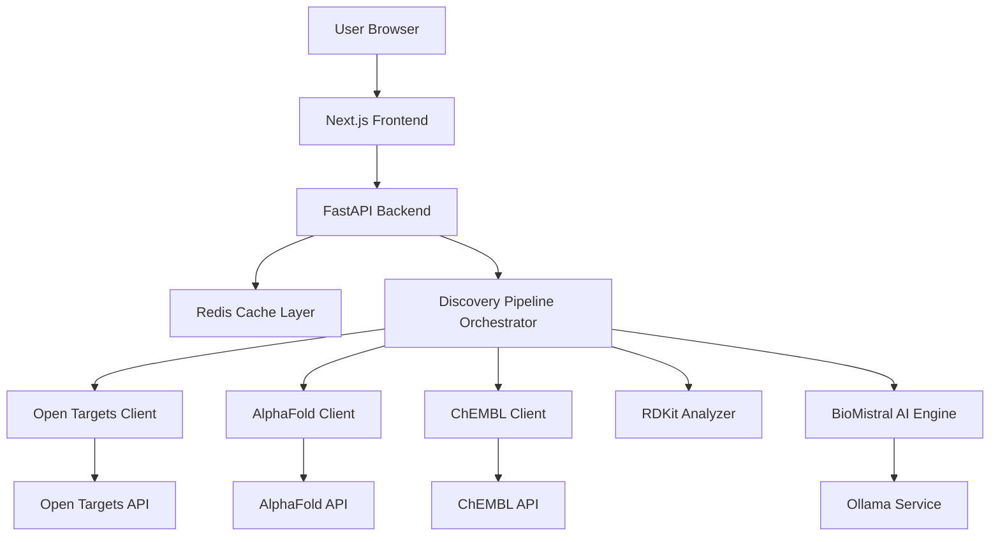
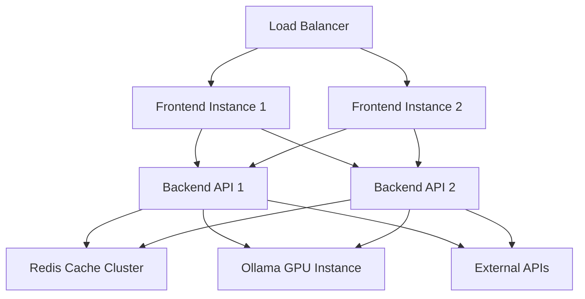

# Design Document: AI-Powered Drug Discovery Platform

## Overview

The AI-Powered Drug Discovery Platform is a full-stack web application that implements an automated proteome-to-cure pipeline. The system transforms disease queries into ranked drug candidates in 8-10 seconds by orchestrating multiple biomedical data sources, AI-powered analysis, and cheminformatics calculations.

The platform consists of:
- **Frontend**: Next.js 14 application with TypeScript and Tailwind CSS
- **Backend**: Python FastAPI server with async/await for concurrent processing
- **External APIs**: Open Targets, ChEMBL, AlphaFold databases
- **AI Engine**: BioMistral-7B via Ollama for biomedical analysis
- **Cheminformatics**: RDKit for molecular property calculations

**Design Philosophy**: The system prioritizes speed and resilience through aggressive caching, concurrent API calls, and graceful degradation when components fail.

## Architecture

### System Architecture




### Architectural Decisions

**Decision 1: Async/Await with Concurrent Processing**
- Rationale: The pipeline makes multiple independent API calls (targets, structures, molecules). Using Python's asyncio with concurrent request limits (5 per API) reduces total latency from ~60s to ~8-10s.
- Trade-off: Increased complexity in error handling and state management.

**Decision 2: Redis for Caching (24-hour TTL)**
- Rationale: External API calls are expensive (latency + rate limits). Caching reduces repeated queries and enables sub-second responses for common diseases.
- Trade-off: Stale data risk mitigated by 24-hour expiration aligned with database update frequencies.

**Decision 3: Graceful Degradation**
- Rationale: Partial results are valuable. If AlphaFold fails, we still provide molecule rankings. If AI fails, we provide scores without analysis.
- Trade-off: More complex error handling logic, but better user experience.

**Decision 4: Client-Side Rendering with Server API**
- Rationale: Next.js frontend provides fast initial load and interactive UI. FastAPI backend handles compute-intensive operations.
- Trade-off: Two deployment targets, but better separation of concerns.

**Decision 5: BioMistral-7B via Ollama**
- Rationale: Local LLM deployment avoids API costs and latency. BioMistral is specialized for biomedical text.
- Trade-off: Requires GPU resources, but provides consistent performance.

## Components and Interfaces

### Backend Components

#### 1. Discovery Pipeline Orchestrator
**Responsibility**: Coordinates the end-to-end drug discovery workflow.

**Interface**:
```python
class DiscoveryPipeline:
    async def discover_drugs(disease_name: str) -> DiscoveryResult:
        """
        Main entry point for drug discovery pipeline.
        Returns ranked drug candidates with analysis.
        """
```

**Workflow**:
1. Query Open Targets for disease-target associations
2. Concurrently fetch AlphaFold structures for targets
3. Concurrently query ChEMBL for bioactive molecules per target
4. Calculate molecular properties (RDKit)
5. Score and rank candidates
6. Generate AI analysis for top 20 candidates
7. Return ranked results


#### 2. Open Targets Client
**Responsibility**: Query Open Targets Platform API for disease-target associations.

**Interface**:
```python
class OpenTargetsClient:
    async def get_disease_targets(disease_name: str) -> List[Target]:
        """
        Returns up to 10 protein targets with confidence >= 0.5.
        Implements retry logic with exponential backoff (3 attempts).
        """
```

**Key Logic**:
- Filter targets by confidence score >= 0.5
- Sort by confidence descending
- Limit to top 10 targets
- Retry failed requests with exponential backoff: 1s, 2s, 4s

#### 3. AlphaFold Client
**Responsibility**: Retrieve 3D protein structures from AlphaFold Database.

**Interface**:
```python
class AlphaFoldClient:
    async def get_protein_structure(uniprot_id: str) -> Optional[ProteinStructure]:
        """
        Returns PDB structure with confidence scores.
        Flags structures with pLDDT < 70 as low confidence.
        Timeout: 10 seconds.
        """
```

**Key Logic**:
- Query by UniProt ID
- Parse PDB format with pLDDT scores
- Flag low confidence (pLDDT < 70)
- Cache for 24 hours
- Continue pipeline if structure unavailable

#### 4. ChEMBL Client
**Responsibility**: Query ChEMBL Database for bioactive molecules.

**Interface**:
```python
class ChEMBLClient:
    async def get_bioactive_molecules(target_id: str) -> List[Molecule]:
        """
        Returns up to 100 molecules with pChEMBL >= 6.0.
        Validates SMILES strings using RDKit.
        """
```

**Key Logic**:
- Filter by pChEMBL >= 6.0 (IC50 <= 1 µM)
- Limit to 100 molecules per target
- Deduplicate molecules across targets
- Validate SMILES with RDKit
- Cache for 24 hours


#### 5. RDKit Analyzer
**Responsibility**: Calculate molecular properties and perform cheminformatics analysis.

**Interface**:
```python
class RDKitAnalyzer:
    def parse_smiles(smiles: str) -> Optional[Mol]:
        """Parse and validate SMILES string."""
    
    def calculate_properties(mol: Mol) -> MolecularProperties:
        """Calculate drug-likeness properties."""
    
    def assess_toxicity(mol: Mol) -> ToxicityAssessment:
        """Screen for toxic substructures."""
    
    def generate_2d_structure(mol: Mol) -> str:
        """Generate 2D SVG representation."""
```

**Molecular Properties Calculated**:
- Molecular weight (MW)
- LogP (lipophilicity)
- Hydrogen bond donors (HBD)
- Hydrogen bond acceptors (HBA)
- Topological polar surface area (TPSA)
- Rotatable bonds
- Aromatic rings
- Canonical SMILES

**Drug-Likeness Scoring**:
- Start with score = 1.0
- Evaluate Lipinski's Rule of Five:
  - MW ≤ 500 Da
  - LogP ≤ 5
  - HBD ≤ 5
  - HBA ≤ 10
- Reduce score by 0.25 per violation
- Flag TPSA > 140 Ų as poor permeability

**Toxicity Screening**:
- SMARTS pattern matching for 10 toxicophores:
  - Azides: `[N-]=[N+]=[N-]`
  - Nitro groups: `[N+](=O)[O-]`
  - Acyl chlorides: `C(=O)Cl`
  - Epoxides: `C1OC1`
  - Peroxides: `OO`
  - Hydrazines: `NN`
  - Sulfonyl chlorides: `S(=O)(=O)Cl`
  - Isocyanates: `N=C=O`
  - Diazo compounds: `C=[N+]=[N-]`
  - Nitroso groups: `N=O`
- Add 0.15 per occurrence, cap at 1.0
- Risk levels: 0-0.3 (low), 0.3-0.6 (medium), >0.6 (high)


#### 6. BioMistral AI Engine
**Responsibility**: Generate biomedical analysis for drug candidates using BioMistral-7B.

**Interface**:
```python
class BioMistralEngine:
    async def analyze_candidate(
        molecule: Molecule,
        target: Target,
        properties: MolecularProperties,
        toxicity: ToxicityAssessment
    ) -> str:
        """
        Generate detailed analysis including:
        - Molecular property interpretation
        - Binding affinity clinical relevance
        - Drug-likeness assessment
        - Safety profile evaluation
        - Mechanism of action
        - Comparison to approved drugs
        """
```

**Prompt Engineering**:
- Structured prompt with molecular data, scores, and context
- Request specific sections: properties, binding, safety, mechanism
- Limit to top 20 candidates for performance
- Fallback to basic ranking if AI unavailable

**Ollama Configuration**:
- Model: `biomistral:7b`
- Temperature: 0.3 (focused, deterministic)
- Max tokens: 500 per analysis
- Timeout: 5 seconds per candidate

#### 7. Scoring and Ranking Engine
**Responsibility**: Calculate composite scores and rank drug candidates.

**Binding Affinity Score** (0-1 scale):
```
binding_score = (pChEMBL - 4) / (10 - 4)
binding_score = clamp(binding_score, 0.0, 1.0)
```

**Confidence Weights** (by measurement type):
- Ki/Kd: 0.9 (direct binding)
- IC50/EC50: 0.8 (functional assay)
- Other: 0.6 (less reliable)

**Composite Score**:
```
composite_score = (
    0.40 * binding_affinity +
    0.30 * drug_likeness +
    0.20 * (1 - toxicity_score) +
    0.10 * novelty_score
)
```

**Rationale for Weights**:
- 40% binding: Primary efficacy indicator
- 30% drug-likeness: Critical for oral bioavailability
- 20% safety: Essential but can be optimized later
- 10% novelty: Encourages exploration of new chemical space


#### 8. Cache Layer
**Responsibility**: Cache external API responses and computed results.

**Interface**:
```python
class CacheLayer:
    async def get(key: str) -> Optional[Any]:
        """Retrieve cached value."""
    
    async def set(key: str, value: Any, ttl: int = 86400):
        """Store value with 24-hour TTL."""
    
    async def invalidate(pattern: str):
        """Clear cache entries matching pattern."""
```

**Cache Keys**:
- `ot:disease:{disease_name}` - Open Targets results
- `af:structure:{uniprot_id}` - AlphaFold structures
- `chembl:molecules:{target_id}` - ChEMBL molecules
- `props:{smiles_hash}` - Molecular properties

**Implementation**: Redis with 24-hour TTL aligned with database update cycles.

### Frontend Components

#### 1. Search Interface
**Responsibility**: Accept disease queries and display loading states.

**Features**:
- Autocomplete for common diseases
- Real-time validation
- Progress indicators during pipeline execution
- Estimated time remaining (8-10s)

#### 2. Results Display
**Responsibility**: Render ranked drug candidates with interactive details.

**Layout**:
- Ranked list with composite scores
- Color-coded risk levels (green/yellow/red)
- Expandable cards for detailed properties
- 2D molecular structure rendering
- 3D protein structure viewer (when available)

**Data Displayed per Candidate**:
- Molecule name and ChEMBL ID
- Composite score (0-1)
- Binding affinity score and target
- Drug-likeness score and Lipinski violations
- Toxicity score and risk level
- AI-generated analysis
- Detailed properties (MW, LogP, TPSA, etc.)


#### 3. Export Functionality
**Responsibility**: Export results in multiple formats.

**Formats**:
- JSON: Complete data structure
- CSV: Tabular format for spreadsheet analysis

**Export Content**:
- All candidate data
- Scores and rankings
- Molecular properties
- AI analysis text
- Query metadata (timestamp, processing time)

## Data Models

### Core Data Structures

```python
@dataclass
class Target:
    """Protein target associated with disease."""
    uniprot_id: str
    gene_symbol: str
    protein_name: str
    confidence_score: float  # 0.5-1.0
    disease_association: str

@dataclass
class ProteinStructure:
    """3D protein structure from AlphaFold."""
    uniprot_id: str
    pdb_data: str
    plddt_score: float  # 0-100
    is_low_confidence: bool  # pLDDT < 70

@dataclass
class Molecule:
    """Bioactive molecule from ChEMBL."""
    chembl_id: str
    name: str
    smiles: str
    canonical_smiles: str
    pchembl_value: float
    activity_type: str  # Ki, Kd, IC50, EC50, etc.
    target_ids: List[str]

@dataclass
class MolecularProperties:
    """Calculated molecular properties."""
    molecular_weight: float
    logp: float
    hbd: int  # H-bond donors
    hba: int  # H-bond acceptors
    tpsa: float  # Topological polar surface area
    rotatable_bonds: int
    aromatic_rings: int
    lipinski_violations: int
    drug_likeness_score: float  # 0-1

@dataclass
class ToxicityAssessment:
    """Toxicity screening results."""
    toxicity_score: float  # 0-1
    risk_level: str  # "low", "medium", "high"
    detected_toxicophores: List[str]
    warnings: List[str]
```


```python
@dataclass
class DrugCandidate:
    """Ranked drug candidate with complete analysis."""
    molecule: Molecule
    target: Target
    properties: MolecularProperties
    toxicity: ToxicityAssessment
    binding_affinity_score: float  # 0-1
    binding_confidence: float  # 0.6-0.9
    composite_score: float  # 0-1
    rank: int
    ai_analysis: Optional[str]
    structure_2d_svg: str

@dataclass
class DiscoveryResult:
    """Complete pipeline result."""
    query: str
    timestamp: datetime
    processing_time_seconds: float
    candidates: List[DrugCandidate]
    targets_found: int
    molecules_analyzed: int
    api_version: str
    warnings: List[str]  # Partial failures, low confidence, etc.
```

### API Request/Response Schemas

```python
class DiscoveryRequest(BaseModel):
    """Request schema for drug discovery endpoint."""
    disease_name: str = Field(..., min_length=2, max_length=200)

class DiscoveryResponse(BaseModel):
    """Response schema for drug discovery endpoint."""
    query: str
    timestamp: str
    processing_time_seconds: float
    candidates: List[DrugCandidate]
    metadata: Dict[str, Any]
    warnings: List[str]

class ErrorResponse(BaseModel):
    """Standard error response format."""
    error_code: str
    message: str
    details: Optional[Dict[str, Any]]
    timestamp: str
```

## Correctness Properties

*A property is a characteristic or behavior that should hold true across all valid executions of a system—essentially, a formal statement about what the system should do. Properties serve as the bridge between human-readable specifications and machine-verifiable correctness guarantees.*


### Property 1: Target Filtering and Ranking
*For any* list of protein targets with confidence scores, the system should filter out targets with confidence < 0.5, sort the remaining targets by confidence in descending order, and limit the result to at most 10 targets.

**Validates: Requirements 1.3, 1.4, 1.5**

### Property 2: Retry with Exponential Backoff
*For any* failed API request, the system should retry up to 3 times with exponentially increasing delays (1s, 2s, 4s) before giving up.

**Validates: Requirements 1.6**

### Property 3: Structure Confidence Classification
*For any* protein structure with a pLDDT score, the system should flag it as low confidence if and only if pLDDT < 70.

**Validates: Requirements 2.3**

### Property 4: Cache Hit Behavior
*For any* cached data with valid TTL, subsequent requests for the same data should return the cached value without making external API calls.

**Validates: Requirements 2.4, 3.7, 9.6**

### Property 5: Graceful Degradation
*For any* pipeline execution where a non-critical component fails (AlphaFold, AI analysis), the system should continue processing and return partial results with appropriate warnings.

**Validates: Requirements 2.5, 7.10, 10.1**

### Property 6: Molecule Filtering by Activity
*For any* list of molecules with pChEMBL values, the system should include only molecules with pChEMBL >= 6.0 and limit the result to at most 100 molecules per target.

**Validates: Requirements 3.2, 3.3**

### Property 7: Molecule Deduplication
*For any* set of molecules found across multiple targets, the system should deduplicate by ChEMBL ID and associate each unique molecule with all relevant target IDs.

**Validates: Requirements 3.4**

### Property 8: SMILES Validation and Canonicalization
*For any* SMILES string, the system should validate it using RDKit, exclude invalid SMILES from results, and generate a canonical SMILES representation for valid strings.

**Validates: Requirements 3.5, 3.6, 14.1, 14.2, 14.4**

### Property 9: Binding Affinity Normalization
*For any* pChEMBL value, the system should normalize it to a 0-1 scale using the formula (pChEMBL - 4) / (10 - 4), clamping values below 4 to 0.0 and values above 10 to 1.0.

**Validates: Requirements 4.1, 4.2**

### Property 10: Maximum Activity Selection
*For any* molecule-target pair with multiple activity measurements, the system should use the highest pChEMBL value for binding affinity calculation.

**Validates: Requirements 4.5**

### Property 11: Measurement Type Confidence Mapping
*For any* activity measurement, the system should assign confidence scores based on measurement type: Ki/Kd → 0.9, IC50/EC50 → 0.8, other → 0.6.

**Validates: Requirements 4.6**


### Property 12: Molecular Property Calculation
*For any* valid molecule (SMILES), the RDKit analyzer should calculate all required properties: molecular weight, LogP, hydrogen bond donors, hydrogen bond acceptors, TPSA, rotatable bonds, and aromatic rings.

**Validates: Requirements 5.1, 5.2, 5.3, 5.4, 5.5, 5.6, 5.7**

### Property 13: Lipinski Rule Evaluation
*For any* molecule with calculated properties, the system should evaluate Lipinski's Rule of Five (MW ≤ 500, LogP ≤ 5, HBD ≤ 5, HBA ≤ 10) and count the number of violations.

**Validates: Requirements 5.8**

### Property 14: Drug-Likeness Scoring
*For any* molecule with Lipinski violations counted, the system should calculate drug-likeness score as 1.0 - (0.25 × violations), ensuring the score is in the range [0, 1].

**Validates: Requirements 5.10**

### Property 15: Membrane Permeability Flagging
*For any* molecule with calculated TPSA, the system should flag it as having poor membrane permeability if and only if TPSA > 140 Ų.

**Validates: Requirements 5.11**

### Property 16: Toxicophore Detection
*For any* valid molecule, the RDKit analyzer should perform SMARTS pattern matching for all 10 toxicophore patterns (azides, nitro groups, acyl chlorides, epoxides, peroxides, hydrazines, sulfonyl chlorides, isocyanates, diazo compounds, nitroso groups) and return all detected matches.

**Validates: Requirements 6.1, 6.2, 6.3, 6.4, 6.5, 6.6, 6.7, 6.8, 6.9, 6.10**

### Property 17: Toxicity Score Calculation
*For any* molecule with detected toxicophores, the system should calculate toxicity score as min(0.15 × count, 1.0), ensuring the score is capped at 1.0.

**Validates: Requirements 6.11, 6.12**

### Property 18: Risk Level Classification
*For any* toxicity score, the system should classify risk as: low (0 ≤ score < 0.3), medium (0.3 ≤ score < 0.6), or high (score ≥ 0.6).

**Validates: Requirements 6.13, 6.14, 6.15**

### Property 19: Composite Score Calculation
*For any* drug candidate with binding affinity, drug-likeness, toxicity, and novelty scores, the system should calculate composite score as: 0.40 × binding + 0.30 × drug_likeness + 0.20 × (1 - toxicity) + 0.10 × novelty.

**Validates: Requirements 7.8**

### Property 20: Candidate Ranking
*For any* list of drug candidates with composite scores, the system should rank them in descending order by composite score.

**Validates: Requirements 7.9**

### Property 21: AI Analysis Limitation
*For any* list of ranked candidates, the system should generate AI analysis for at most the top 20 candidates.

**Validates: Requirements 7.11**

### Property 22: JSON Export Round-Trip
*For any* discovery result, exporting to JSON and then parsing should produce an equivalent result structure with all candidate data preserved.

**Validates: Requirements 8.10**

### Property 23: Input Sanitization
*For any* user input (disease name), the system should sanitize it to prevent injection attacks by validating length (2-200 characters) and rejecting strings with special characters that could be malicious.

**Validates: Requirements 12.5**

### Property 24: Rate Limiting
*For any* IP address making requests, the system should enforce a limit of 100 requests per minute, returning HTTP 429 when exceeded.

**Validates: Requirements 12.3, 12.4**


### Property 25: Configuration Validation
*For any* system startup, the system should validate that all required environment variables are present and fail fast with clear error messages if any are missing.

**Validates: Requirements 13.8**

### Property 26: SMILES Feature Support
*For any* valid SMILES string containing aromatic rings, charges, or stereochemistry notation, the RDKit parser should successfully parse it and preserve these features in the canonical representation.

**Validates: Requirements 14.3**

### Property 27: Molecule Size Validation
*For any* parsed molecule, the system should validate that it contains at least 1 atom and at most 200 atoms, rejecting molecules outside this range.

**Validates: Requirements 14.5, 14.6**

### Property 28: API Response Structure
*For any* successful discovery request, the response should be valid JSON containing: query, timestamp, processing_time_seconds, candidates array, and metadata object.

**Validates: Requirements 15.1, 15.2**

### Property 29: SMILES Serialization
*For any* drug candidate in an API response, the molecular structure should be serialized as a SMILES string.

**Validates: Requirements 15.3**

### Property 30: Score Precision
*For any* numerical score in an API response, the value should be formatted with exactly 2 decimal places.

**Validates: Requirements 15.4**

### Property 31: Error Response Format
*For any* error condition, the system should return a consistent error response containing: error_code, message, optional details, and timestamp.

**Validates: Requirements 15.5**

### Property 32: HTTP Status Code Accuracy
*For any* API response, the HTTP status code should accurately reflect the response type: 200 for success, 400 for invalid input, 429 for rate limiting, 500 for server errors.

**Validates: Requirements 15.6**

## Error Handling

### Error Categories

**1. External API Failures**
- Open Targets, ChEMBL, AlphaFold unavailable
- Strategy: Retry with exponential backoff, then graceful degradation
- User Impact: Partial results with warnings

**2. Parsing Failures**
- Invalid SMILES strings
- Malformed API responses
- Strategy: Skip invalid entries, log errors, continue processing
- User Impact: Reduced candidate count, warnings in results

**3. AI Model Failures**
- Ollama unavailable or timeout
- Strategy: Provide results without AI analysis
- User Impact: Basic ranking without detailed analysis

**4. Validation Failures**
- Invalid disease names
- Malformed requests
- Strategy: Return 400 error with clear message
- User Impact: Immediate feedback to correct input


**5. Performance Issues**
- Slow API responses
- Large result sets
- Strategy: Timeouts, pagination, caching
- User Impact: May see reduced results or longer wait times

### Error Response Format

All errors follow a consistent structure:

```json
{
  "error_code": "INVALID_DISEASE_NAME",
  "message": "Disease name must be between 2 and 200 characters",
  "details": {
    "provided_length": 1,
    "min_length": 2,
    "max_length": 200
  },
  "timestamp": "2026-01-31T12:34:56Z"
}
```

### Logging Strategy

**Log Levels**:
- ERROR: External API failures, parsing errors, unexpected exceptions
- WARNING: Partial failures, low confidence results, cache misses
- INFO: Request/response metadata, pipeline stages
- DEBUG: Detailed API calls, cache operations, scoring calculations

**Log Context**:
- Request ID for tracing
- User IP (anonymized)
- Timestamp
- Processing stage
- Error details with stack traces

## Testing Strategy

### Dual Testing Approach

The platform requires both unit tests and property-based tests for comprehensive coverage:

**Unit Tests**: Verify specific examples, edge cases, and error conditions
- Specific disease queries (e.g., "Alzheimer's disease")
- Edge cases (empty results, timeouts, invalid SMILES)
- Integration points between components
- Error handling paths

**Property Tests**: Verify universal properties across all inputs
- Filtering and ranking logic with random data
- Score calculations with random values
- SMILES parsing with generated molecules
- API response format with random results

Both approaches are complementary and necessary for ensuring correctness.

### Property-Based Testing Configuration

**Framework**: Hypothesis (Python) for backend, fast-check (TypeScript) for frontend

**Test Configuration**:
- Minimum 100 iterations per property test
- Each test references its design document property
- Tag format: `# Feature: drug-discovery-platform, Property N: [property text]`

**Example Property Test**:
```python
from hypothesis import given, strategies as st

# Feature: drug-discovery-platform, Property 9: Binding Affinity Normalization
@given(pchembl=st.floats(min_value=0, max_value=15))
def test_binding_affinity_normalization(pchembl):
    score = normalize_binding_affinity(pchembl)
    
    # Score should be in [0, 1]
    assert 0.0 <= score <= 1.0
    
    # Values below 4 should map to 0
    if pchembl < 4:
        assert score == 0.0
    
    # Values above 10 should map to 1
    elif pchembl > 10:
        assert score == 1.0
    
    # Values in range should follow formula
    else:
        expected = (pchembl - 4) / (10 - 4)
        assert abs(score - expected) < 0.001
```


### Test Coverage Strategy

**Backend Testing**:
1. **API Client Tests** (Open Targets, ChEMBL, AlphaFold)
   - Property: Retry logic, response parsing, error handling
   - Unit: Specific API responses, timeout scenarios

2. **RDKit Analyzer Tests**
   - Property: SMILES parsing, property calculations, toxicophore detection
   - Unit: Specific molecules (aspirin, caffeine), invalid SMILES

3. **Scoring Engine Tests**
   - Property: Score normalization, composite calculation, ranking
   - Unit: Edge cases (all zeros, all ones), specific score combinations

4. **Pipeline Orchestrator Tests**
   - Property: Graceful degradation, concurrent processing
   - Unit: Specific failure scenarios, integration flows

5. **Cache Layer Tests**
   - Property: Cache hit/miss behavior, TTL expiration
   - Unit: Specific cache keys, Redis connection failures

6. **API Endpoint Tests**
   - Property: Request validation, response format, error responses
   - Unit: Specific disease queries, malformed requests

**Frontend Testing**:
1. **Component Tests**
   - Unit: Search interface, results display, export functionality
   - Integration: User flows (search → view → export)

2. **API Integration Tests**
   - Unit: API client, error handling, loading states

### Test Data Strategy

**Property Test Generators**:
- Random SMILES strings (valid and invalid)
- Random pChEMBL values (0-15 range)
- Random molecular properties (realistic ranges)
- Random target lists with confidence scores
- Random molecule lists with activity data

**Unit Test Fixtures**:
- Real molecules from ChEMBL (aspirin, ibuprofen, etc.)
- Known disease-target associations
- Sample API responses (captured from real APIs)
- Edge cases (empty lists, null values, extreme scores)

### Performance Testing

**Benchmarks**:
- End-to-end pipeline: 8-10 seconds target
- Cache hit response: < 100ms
- SMILES parsing: < 10ms per molecule
- Property calculation: < 50ms per molecule
- AI analysis: < 5 seconds per candidate

**Load Testing**:
- Concurrent requests: 10 simultaneous users
- Rate limiting: 100 requests/minute per IP
- Cache effectiveness: > 80% hit rate for common diseases

## Deployment Architecture

### Production Environment



### Infrastructure Requirements

**Backend**:
- Python 3.11+
- FastAPI with uvicorn
- Redis 7.0+ for caching
- 4 CPU cores, 8GB RAM per instance
- GPU instance for Ollama (NVIDIA T4 or better)

**Frontend**:
- Node.js 18+
- Next.js 14
- 2 CPU cores, 4GB RAM per instance

**Ollama**:
- BioMistral-7B model (~4GB)
- NVIDIA GPU with 8GB+ VRAM
- CUDA 11.8+

### Environment Variables

**Backend** (`.env`):
```
# API Configuration
API_PORT=8000
API_HOST=0.0.0.0
CORS_ORIGINS=https://drugdiscovery.example.com

# External APIs
OPEN_TARGETS_API_URL=https://api.platform.opentargets.org/api/v4
CHEMBL_API_URL=https://www.ebi.ac.uk/chembl/api/data
ALPHAFOLD_API_URL=https://alphafold.ebi.ac.uk/api

# Ollama Configuration
OLLAMA_BASE_URL=http://localhost:11434
OLLAMA_MODEL=biomistral:7b
OLLAMA_TIMEOUT=5

# Cache Configuration
REDIS_URL=redis://localhost:6379
CACHE_TTL=86400

# Rate Limiting
RATE_LIMIT_PER_MINUTE=100

# Logging
LOG_LEVEL=INFO
```

**Frontend** (`.env.local`):
```
NEXT_PUBLIC_API_URL=https://api.drugdiscovery.example.com
```

### Security Considerations

**1. HTTPS Enforcement**
- All production traffic over TLS 1.3
- Certificate management via Let's Encrypt

**2. CORS Configuration**
- Whitelist frontend domain only
- No wildcard origins in production

**3. Rate Limiting**
- 100 requests/minute per IP
- Distributed rate limiting via Redis

**4. Input Validation**
- Pydantic schemas for all requests
- Length limits (2-200 characters for disease names)
- Sanitization to prevent injection

**5. Data Privacy**
- No storage of user health data
- IP anonymization in logs
- Medical disclaimer on all pages

**6. API Key Management**
- External API keys in environment variables
- Rotation policy for credentials
- No keys in code or version control

### Monitoring and Observability

**Metrics**:
- Request rate and latency (p50, p95, p99)
- Error rates by type
- Cache hit/miss rates
- External API response times
- AI model inference time
- Pipeline stage durations

**Alerts**:
- Error rate > 5%
- Latency p95 > 15 seconds
- Cache hit rate < 70%
- External API failures > 10%
- Rate limit violations

**Logging**:
- Structured JSON logs
- Request tracing with correlation IDs
- Error tracking with stack traces
- Performance profiling for slow requests

## Future Enhancements

**Phase 2 Features**:
1. User accounts and saved searches
2. Batch processing for multiple diseases
3. Custom scoring weight configuration
4. Integration with additional databases (PubChem, DrugBank)
5. 3D molecular docking simulations
6. Clinical trial data integration
7. Patent and literature search
8. Collaborative features (sharing, annotations)

**Technical Improvements**:
1. GraphQL API for flexible queries
2. WebSocket support for real-time updates
3. Distributed caching with Redis Cluster
4. Horizontal scaling with Kubernetes
5. A/B testing framework for scoring algorithms
6. Machine learning for novelty scoring
7. Advanced visualization (3D protein-ligand complexes)
8. Mobile application (iOS/Android)
