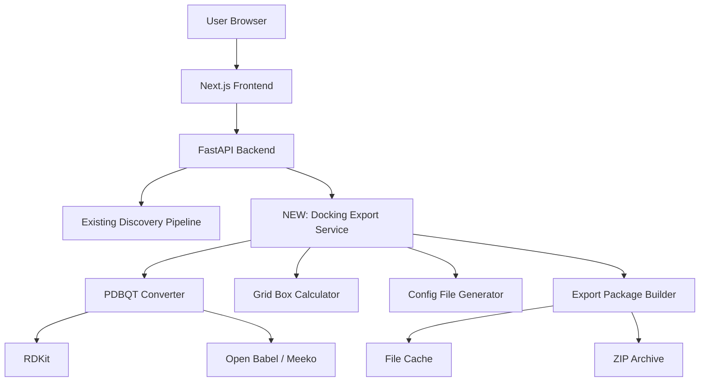

# Design Document: Docking Integration

## Overview

The Docking Integration feature extends the AI-Powered Drug Discovery Platform by enabling researchers to export protein-ligand pairs for molecular docking validation using AutoDock Vina. This feature bridges computational drug discovery with structural validation by automatically generating PDBQT files, calculating grid box coordinates, and creating ready-to-run docking configurations.

The integration is designed as a non-disruptive extension that:
- Leverages existing protein structures from AlphaFold
- Uses existing ligand SMILES from ChEMBL
- Adds new export functionality without modifying core discovery pipeline
- Provides a complete docking workflow package

**Key Design Principles**:
- **Non-invasive**: Extends existing platform without modifying core components
- **Automated**: Minimizes manual preparation steps for researchers
- **Validated**: Ensures all generated files are valid for AutoDock Vina
- **Documented**: Provides clear instructions for users new to docking

## Architecture

### System Architecture Extension



### Architectural Decisions

**Decision 1: Use Open Babel/Meeko for PDBQT Conversion**
- Rationale: Open Babel and Meeko are standard tools for PDBQT generation with proper charge assignment and bond detection
- Alternative considered: Custom RDKit-based converter (rejected due to complexity of PDBQT format)
- Trade-off: External dependency, but ensures compatibility with AutoDock Vina

**Decision 2: Geometric Center for Default Grid Box**
- Rationale: Without known binding site data, geometric center provides reasonable starting point
- Alternative considered: Pocket detection algorithms (deferred to future enhancement)
- Trade-off: May not be optimal for all proteins, but users can adjust in config files

**Decision 3: Batch Export with ZIP Archive**
- Rationale: Single download simplifies file transfer and organization
- Alternative considered: Individual file downloads (rejected as too cumbersome)
- Trade-off: Larger download size, but better user experience

**Decision 4: Async Processing with Progress Updates**
- Rationale: PDBQT conversion can take several seconds per molecule
- Alternative considered: Synchronous processing (rejected due to timeout risk)
- Trade-off: More complex implementation, but better UX for large exports

**Decision 5: 24-Hour Cache for Generated Files**
- Rationale: Allows re-download without regeneration, aligned with existing cache strategy
- Alternative considered: No caching (rejected as wasteful)
- Trade-off: Storage space, but improves performance

## Components and Interfaces

### Backend Components

#### 1. Docking Export Service
**Responsibility**: Orchestrate the complete docking export workflow.

**Interface**:
```python
class DockingExportService:
    async def export_docking_files(
        candidate_ids: List[str],
        grid_params: Optional[GridBoxParams] = None,
        docking_params: Optional[DockingParams] = None
    ) -> DockingExportResult:
        """
        Generate complete docking package for selected candidates.
        Returns ZIP archive with all files and configurations.
        """
```

**Workflow**:
1. Validate candidate IDs and retrieve candidate data
2. Group candidates by target protein
3. For each target:
   - Convert protein structure to PDBQT (receptor)
   - Calculate grid box coordinates
4. For each ligand:
   - Generate 3D structure from SMILES
   - Convert to PDBQT format
5. Generate configuration files for each protein-ligand pair
6. Create batch scripts (Linux/Mac and Windows)
7. Generate README with instructions
8. Package all files into ZIP archive
9. Cache ZIP for 24 hours
10. Return download URL

#### 2. PDBQT Converter
**Responsibility**: Convert protein and ligand structures to PDBQT format.

**Interface**:
```python
class PDBQTConverter:
    def convert_protein_to_pdbqt(
        pdb_data: str,
        output_path: str
    ) -> PDBQTConversionResult:
        """
        Convert PDB protein structure to PDBQT format.
        Adds hydrogens, assigns charges, merges non-polar H.
        """
    
    def convert_ligand_to_pdbqt(
        smiles: str,
        output_path: str,
        ligand_name: str
    ) -> PDBQTConversionResult:
        """
        Convert SMILES to 3D structure, then to PDBQT format.
        Generates conformer, adds hydrogens, assigns charges, detects rotatable bonds.
        """
```

**Protein Conversion Steps**:
1. Parse PDB data
2. Add hydrogen atoms using Open Babel
3. Assign Gasteiger partial charges
4. Merge non-polar hydrogens
5. Detect and preserve metal ions/cofactors
6. Write PDBQT format with atom types
7. Validate output file

**Ligand Conversion Steps**:
1. Parse SMILES with RDKit
2. Generate 3D conformer using ETKDG algorithm
3. Optimize geometry with MMFF94 force field (max 200 iterations)
4. Convert RDKit molecule to PDB format
5. Use Meeko to convert PDB to PDBQT
6. Detect and mark rotatable bonds
7. Set root atom for torsion tree
8. Validate output file

**Error Handling**:
- Invalid SMILES: Log error, skip ligand
- 3D generation failure: Try alternative conformer generation
- Charge assignment failure: Use default charges with warning
- File write failure: Raise exception with clear message

#### 3. Grid Box Calculator
**Responsibility**: Calculate grid box coordinates for docking search space.

**Interface**:
```python
class GridBoxCalculator:
    def calculate_grid_box(
        pdb_data: str,
        binding_site: Optional[BindingSite] = None
    ) -> GridBox:
        """
        Calculate grid box center and dimensions.
        Uses binding site if provided, otherwise geometric center.
        """
```

**Calculation Logic**:

**Default Mode (No Binding Site)**:
```python
# Calculate geometric center
atoms = parse_pdb_atoms(pdb_data)
center_x = mean([atom.x for atom in atoms])
center_y = mean([atom.y for atom in atoms])
center_z = mean([atom.z for atom in atoms])

# Default dimensions
size_x = size_y = size_z = 25.0  # Angstroms
```

**Binding Site Mode** (Future Enhancement):
```python
# Center on binding site residues
binding_atoms = get_binding_site_atoms(pdb_data, binding_site)
center_x = mean([atom.x for atom in binding_atoms])
center_y = mean([atom.y for atom in binding_atoms])
center_z = mean([atom.z for atom in binding_atoms])

# Calculate dimensions to encompass binding site + buffer
size_x = max_x - min_x + 10.0  # 5Å buffer on each side
size_y = max_y - min_y + 10.0
size_z = max_z - min_z + 10.0
```

**Validation**:
- Ensure dimensions are between 10 Å and 50 Å
- Round coordinates to 2 decimal places
- Warn if grid box is unusually large or small

#### 4. Configuration File Generator
**Responsibility**: Generate AutoDock Vina configuration files.

**Interface**:
```python
class ConfigFileGenerator:
    def generate_config(
        receptor_path: str,
        ligand_path: str,
        grid_box: GridBox,
        docking_params: DockingParams,
        output_path: str
    ) -> str:
        """
        Generate AutoDock Vina configuration file.
        Returns path to generated config file.
        """
```

**Configuration File Format**:
```
receptor = receptor.pdbqt
ligand = ligand.pdbqt

center_x = 12.34
center_y = 56.78
center_z = 90.12

size_x = 25.0
size_y = 25.0
size_z = 25.0

exhaustiveness = 8
num_modes = 9
energy_range = 3

out = docking_result.pdbqt
log = docking_log.txt
```

**Parameter Defaults**:
- `exhaustiveness`: 8 (good balance of speed and accuracy)
- `num_modes`: 9 (number of binding modes to generate)
- `energy_range`: 3 kcal/mol (energy difference threshold)

**Validation**:
- Ensure all required fields are present
- Validate numeric ranges
- Check file paths are relative to config location

#### 5. Export Package Builder
**Responsibility**: Organize and package all docking files into a ZIP archive.

**Interface**:
```python
class ExportPackageBuilder:
    async def build_package(
        targets: List[TargetExportData],
        export_id: str
    ) -> str:
        """
        Build complete docking export package.
        Returns path to ZIP archive.
        """
```

**Package Structure**:
```
docking_export_alzheimers_20260131_123456/
├── README.txt
├── run_docking.sh
├── run_docking.bat
├── target_BACE1_P56817/
│   ├── receptor_BACE1.pdbqt
│   ├── ligand_CHEMBL123.pdbqt
│   ├── ligand_CHEMBL456.pdbqt
│   ├── config_BACE1_CHEMBL123.txt
│   ├── config_BACE1_CHEMBL456.txt
├── target_APP_P05067/
│   ├── receptor_APP.pdbqt
│   ├── ligand_CHEMBL789.pdbqt
│   ├── config_APP_CHEMBL789.txt
```

**File Naming Conventions**:
- Receptors: `receptor_{gene_symbol}.pdbqt`
- Ligands: `ligand_{chembl_id}.pdbqt`
- Configs: `config_{gene_symbol}_{chembl_id}.txt`
- Results: `result_{gene_symbol}_{chembl_id}.pdbqt`
- Logs: `log_{gene_symbol}_{chembl_id}.txt`

#### 6. Batch Script Generator
**Responsibility**: Generate executable scripts to run all docking jobs.

**Interface**:
```python
class BatchScriptGenerator:
    def generate_linux_script(
        targets: List[TargetExportData],
        output_path: str
    ) -> str:
        """Generate bash script for Linux/Mac."""
    
    def generate_windows_script(
        targets: List[TargetExportData],
        output_path: str
    ) -> str:
        """Generate batch file for Windows."""
```

**Linux/Mac Script Template**:
```bash
#!/bin/bash
# AutoDock Vina Batch Docking Script
# Generated by AI-Powered Drug Discovery Platform

echo "Starting docking jobs at $(date)"
echo "================================"

# Check if vina is installed
if ! command -v vina &> /dev/null; then
    echo "ERROR: AutoDock Vina not found. Please install it first."
    echo "Visit: https://vina.scripps.edu/"
    exit 1
fi

# Create results directory
mkdir -p results

# Run docking for each configuration
for config in target_*/config_*.txt; do
    echo "Processing: $config"
    vina --config "$config" 2>&1 | tee "results/$(basename $config .txt).log"
    
    if [ $? -eq 0 ]; then
        echo "✓ Success: $config"
    else
        echo "✗ Failed: $config"
    fi
    echo "---"
done

echo "================================"
echo "Docking completed at $(date)"
echo "Results saved in results/ directory"
```

**Windows Script Template**:
```batch
@echo off
REM AutoDock Vina Batch Docking Script
REM Generated by AI-Powered Drug Discovery Platform

echo Starting docking jobs at %date% %time%
echo ================================

REM Check if vina is installed
where vina >nul 2>nul
if %errorlevel% neq 0 (
    echo ERROR: AutoDock Vina not found. Please install it first.
    echo Visit: https://vina.scripps.edu/
    exit /b 1
)

REM Create results directory
if not exist results mkdir results

REM Run docking for each configuration
for /r %%f in (target_*\config_*.txt) do (
    echo Processing: %%f
    vina --config "%%f" > "results\%%~nf.log" 2>&1
    
    if %errorlevel% equ 0 (
        echo Success: %%f
    ) else (
        echo Failed: %%f
    )
    echo ---
)

echo ================================
echo Docking completed at %date% %time%
echo Results saved in results\ directory
pause
```

#### 7. README Generator
**Responsibility**: Generate comprehensive documentation for the export package.

**Interface**:
```python
class ReadmeGenerator:
    def generate_readme(
        targets: List[TargetExportData],
        export_metadata: ExportMetadata
    ) -> str:
        """Generate README.txt with instructions and documentation."""
```

**README Content Sections**:

1. **Introduction**: Overview of the export package
2. **System Requirements**: AutoDock Vina, Python, dependencies
3. **Installation Instructions**: How to install AutoDock Vina
4. **File Structure**: Explanation of directory organization
5. **Quick Start**: Simple commands to run docking
6. **Batch Processing**: How to use the batch scripts
7. **Configuration Files**: Explanation of parameters
8. **Interpreting Results**: How to read docking output
9. **Troubleshooting**: Common errors and solutions
10. **References**: Links to AutoDock Vina documentation

### Frontend Components

#### 1. Docking Selection Interface
**Responsibility**: Allow users to select candidates for docking export.

**Component**: `DockingSelectionPanel.tsx`

**Features**:
- Checkbox on each candidate card
- "Select All" / "Deselect All" buttons
- Selection counter badge
- Floating action button when selections exist
- Visual indication of selected items

**State Management**:
```typescript
interface DockingSelectionState {
  selectedCandidates: Set<string>;  // Candidate IDs
  isExportModalOpen: boolean;
  exportProgress: ExportProgress | null;
}
```

#### 2. Docking Export Modal
**Responsibility**: Configure and initiate docking export.

**Component**: `DockingExportModal.tsx`

**Features**:
- Summary of selected protein-ligand pairs
- Grouped by target protein
- Advanced options (collapsible):
  - Grid box parameters (center, size)
  - Docking parameters (exhaustiveness, num_modes, energy_range)
- Export button
- Cancel button

**Props**:
```typescript
interface DockingExportModalProps {
  selectedCandidates: DrugCandidate[];
  onExport: (params: ExportParams) => Promise<void>;
  onCancel: () => void;
}
```

#### 3. Export Progress Indicator
**Responsibility**: Display real-time progress during export generation.

**Component**: `ExportProgressIndicator.tsx`

**Features**:
- Progress bar (0-100%)
- Current step description
- Estimated time remaining
- Cancel button
- Error display if step fails

**Progress Steps**:
1. Validating candidates (5%)
2. Converting receptors to PDBQT (20%)
3. Converting ligands to PDBQT (50%)
4. Generating configurations (70%)
5. Creating batch scripts (80%)
6. Building ZIP archive (95%)
7. Complete (100%)

#### 4. Docking Export API Client
**Responsibility**: Handle API communication for docking export.

**Module**: `lib/docking-api.ts`

**Interface**:
```typescript
export async function exportDockingFiles(
  candidateIds: string[],
  options?: DockingExportOptions
): Promise<DockingExportResult> {
  // POST to /api/docking/export
  // Poll for progress updates
  // Return download URL when complete
}

export async function getDockingExportStatus(
  exportId: string
): Promise<ExportStatus> {
  // GET /api/docking/export/{exportId}/status
}

export async function cancelDockingExport(
  exportId: string
): Promise<void> {
  // DELETE /api/docking/export/{exportId}
}
```

## Data Models

### Core Data Structures

```python
@dataclass
class GridBox:
    """Grid box parameters for docking."""
    center_x: float
    center_y: float
    center_z: float
    size_x: float = 25.0
    size_y: float = 25.0
    size_z: float = 25.0

@dataclass
class DockingParams:
    """AutoDock Vina docking parameters."""
    exhaustiveness: int = 8
    num_modes: int = 9
    energy_range: float = 3.0

@dataclass
class PDBQTConversionResult:
    """Result of PDBQT conversion."""
    success: bool
    output_path: Optional[str]
    error_message: Optional[str]
    warnings: List[str]

@dataclass
class TargetExportData:
    """Export data for a single target."""
    target: Target
    receptor_pdbqt_path: str
    ligands: List[LigandExportData]
    grid_box: GridBox

@dataclass
class LigandExportData:
    """Export data for a single ligand."""
    molecule: Molecule
    ligand_pdbqt_path: str
    config_file_path: str

@dataclass
class DockingExportResult:
    """Complete docking export result."""
    export_id: str
    zip_file_path: str
    download_url: str
    targets_count: int
    ligands_count: int
    file_size_mb: float
    generation_time_seconds: float
    warnings: List[str]
```

### API Request/Response Schemas

```python
class DockingExportRequest(BaseModel):
    """Request schema for docking export."""
    candidate_ids: List[str] = Field(..., min_items=1, max_items=50)
    grid_params: Optional[GridBox] = None
    docking_params: Optional[DockingParams] = None

class DockingExportResponse(BaseModel):
    """Response schema for docking export."""
    export_id: str
    download_url: str
    targets_count: int
    ligands_count: int
    file_size_mb: float
    generation_time_seconds: float
    warnings: List[str]

class ExportStatusResponse(BaseModel):
    """Response schema for export status."""
    export_id: str
    status: str  # "pending", "processing", "complete", "failed"
    progress_percent: int
    current_step: str
    estimated_time_remaining_seconds: Optional[int]
    error_message: Optional[str]
```

## Correctness Properties

*A property is a characteristic or behavior that should hold true across all valid executions of a system—essentially, a formal statement about what the system should do. Properties serve as the bridge between human-readable specifications and machine-verifiable correctness guarantees.*


### Property 1: Selection State Management
*For any* drug candidate, clicking "Prepare for Docking" should toggle its selection state, adding it to the selection set if not present, or removing it if already selected.

**Validates: Requirements 1.2**

### Property 2: Target Grouping
*For any* list of selected candidates, the system should group them by target protein UniProt ID, ensuring all candidates with the same target are in the same group.

**Validates: Requirements 1.3**

### Property 3: Selection Limit Enforcement
*For any* selection attempt, the system should allow selection only if the total count is at most 50, rejecting selections that would exceed this limit.

**Validates: Requirements 1.4**

### Property 4: Selection Counter Accuracy
*For any* selection state, the displayed counter value should equal the number of selected candidate IDs in the selection set.

**Validates: Requirements 1.6**

### Property 5: PDB to PDBQT Conversion
*For any* valid PDB protein structure, the conversion to PDBQT format should produce a valid PDBQT file with all required atom type and charge fields populated.

**Validates: Requirements 2.1, 2.7**

### Property 6: Hydrogen Addition to Proteins
*For any* protein structure converted to PDBQT, the output should contain hydrogen atoms (atom type 'H' or 'HD') that were not present in the input PDB.

**Validates: Requirements 2.2**

### Property 7: Charge Assignment to Proteins
*For any* protein structure converted to PDBQT, all atoms in the output should have non-zero partial charge values assigned.

**Validates: Requirements 2.3**

### Property 8: Metal Ion Preservation
*For any* protein structure containing metal ions (Fe, Zn, Mg, Ca, etc.), the converted PDBQT should preserve these atoms with their original coordinates and proper atom types.

**Validates: Requirements 2.5**

### Property 9: SMILES to 3D Structure Generation
*For any* valid SMILES string, the system should generate a 3D molecular structure with atomic coordinates in 3D space (non-zero z-coordinates).

**Validates: Requirements 3.1**

### Property 10: Hydrogen Addition to Ligands
*For any* ligand converted to PDBQT, the output should contain hydrogen atoms that complete the valence of all heavy atoms.

**Validates: Requirements 3.3**

### Property 11: Ligand Charge Assignment
*For any* ligand converted to PDBQT, all atoms should have Gasteiger partial charges assigned (non-zero charge field).

**Validates: Requirements 3.4**

### Property 12: Rotatable Bond Detection
*For any* ligand converted to PDBQT, the system should detect and mark rotatable bonds (single bonds between non-terminal heavy atoms, excluding amide bonds).

**Validates: Requirements 3.5**

### Property 13: Ligand PDBQT Validation
*For any* generated ligand PDBQT file, parsing it should reveal valid AutoDock atom types, rotatable bond markers (BRANCH/ENDBRANCH), and a designated ROOT atom.

**Validates: Requirements 3.7**

### Property 14: Geometric Center Calculation
*For any* protein structure with N atoms, the geometric center should be the mean of all atom coordinates: (mean(x), mean(y), mean(z)).

**Validates: Requirements 4.1, 4.2**

### Property 15: Grid Box Coordinate Precision
*For any* calculated grid box, all coordinate values (center_x, center_y, center_z, size_x, size_y, size_z) should be formatted with exactly 2 decimal places.

**Validates: Requirements 4.5**

### Property 16: Grid Box Dimension Validation
*For any* grid box, each dimension (size_x, size_y, size_z) should be within the range [10.0, 50.0] Angstroms.

**Validates: Requirements 4.6**

### Property 17: Configuration File Completeness
*For any* generated AutoDock Vina configuration file, it should contain all required fields: receptor, ligand, center_x, center_y, center_z, size_x, size_y, size_z, exhaustiveness, num_modes, energy_range, and out.

**Validates: Requirements 5.2, 5.3, 5.4, 5.5, 5.9**

### Property 18: Configuration File Format Validation
*For any* generated configuration file, parsing it should successfully extract all parameter values, and the format should match AutoDock Vina specification (key = value pairs).

**Validates: Requirements 5.10**

### Property 19: ZIP Archive Creation
*For any* docking export request, the system should create a ZIP archive that can be successfully opened and contains all expected files.

**Validates: Requirements 6.1, 6.9**

### Property 20: Target Folder Organization
*For any* set of targets in an export, the ZIP archive should contain exactly one folder per unique target, named with the pattern "target_{gene_symbol}_{uniprot_id}".

**Validates: Requirements 6.2**

### Property 21: File Placement in Target Folders
*For any* target folder in the export, it should contain exactly one receptor PDBQT file, N ligand PDBQT files (where N is the number of ligands for that target), and N configuration files.

**Validates: Requirements 6.3, 6.4, 6.5**

### Property 22: Required Export Files
*For any* export ZIP archive, it should contain README.txt, run_docking.sh, and run_docking.bat files at the root level.

**Validates: Requirements 6.6, 6.7**

### Property 23: ZIP Filename Format
*For any* generated ZIP file, the filename should match the pattern "docking_export_{disease_name}_{timestamp}.zip" where timestamp is in format YYYYMMDD_HHMMSS.

**Validates: Requirements 6.8**

### Property 24: Request Payload Validation
*For any* request to the docking export endpoint, the system should validate that candidate_ids is a non-empty list with at most 50 items, rejecting invalid requests with HTTP 400.

**Validates: Requirements 10.2, 10.3**

### Property 25: Optional Parameter Acceptance
*For any* docking export request, the system should accept and use custom grid_params and docking_params when provided, or use defaults when omitted.

**Validates: Requirements 10.4, 10.5**

### Property 26: Successful Export Response Format
*For any* successful docking export, the response should be valid JSON containing: export_id, download_url, targets_count, ligands_count, file_size_mb, generation_time_seconds, and warnings array.

**Validates: Requirements 10.7**

### Property 27: Download Response Headers
*For any* ZIP file download response, the HTTP headers should include Content-Type: application/zip and Content-Disposition with the filename.

**Validates: Requirements 10.8, 10.9**

### Property 28: Error Response Format
*For any* failed docking export request, the response should include an appropriate HTTP status code (400 for validation errors, 500 for server errors) and a JSON body with error details.

**Validates: Requirements 10.10**

### Property 29: Cache Key Consistency
*For any* two export requests with identical candidate_ids and parameters, the system should generate the same cache key, enabling cache hits.

**Validates: Requirements 11.2**

### Property 30: Cache Hit Behavior
*For any* cached export that is still valid (within 24-hour TTL), requesting the same export should return the cached ZIP file without regenerating files.

**Validates: Requirements 11.3**

### Property 31: Cache Validation
*For any* cache retrieval attempt, the system should verify the cached ZIP file exists on disk before returning it, regenerating if missing.

**Validates: Requirements 11.4, 11.5**

### Property 32: Concurrency Limit Enforcement
*For any* batch of PDBQT conversions, the system should process at most 5 conversions concurrently, queuing additional conversions until slots become available.

**Validates: Requirements 15.2**

### Property 33: ZIP Size Limit Enforcement
*For any* generated ZIP archive, if the file size exceeds 500 MB, the system should reject the export and return an error message suggesting to reduce the selection.

**Validates: Requirements 15.6**

### Property 34: Temporary File Cleanup
*For any* completed export (successful or failed), the system should delete all temporary files (intermediate PDB, PDBQT files not in final ZIP) within 1 hour of completion.

**Validates: Requirements 15.8**

## Error Handling

### Error Categories

**1. PDBQT Conversion Failures**
- Invalid SMILES strings
- 3D structure generation failures
- Charge assignment failures
- Strategy: Log error, skip molecule, continue with remaining candidates
- User Impact: Reduced candidate count, warning in export results

**2. File System Errors**
- Disk space exhaustion
- Permission denied
- Strategy: Return HTTP 500 with clear error message
- User Impact: Export fails, user notified to contact support

**3. Validation Errors**
- Too many candidates selected (>50)
- Invalid candidate IDs
- Invalid grid box parameters
- Strategy: Return HTTP 400 with validation details
- User Impact: Immediate feedback to correct input

**4. External Dependency Failures**
- Open Babel not installed
- Meeko not available
- Strategy: Return HTTP 500 with installation instructions
- User Impact: Export fails, user provided with setup guidance

**5. Cache Failures**
- Redis unavailable
- Cache corruption
- Strategy: Bypass cache, generate fresh files
- User Impact: Slower response, but functionality preserved

### Error Response Format

All errors follow a consistent structure:

```json
{
  "error_code": "PDBQT_CONVERSION_FAILED",
  "message": "Failed to convert ligand CHEMBL123 to PDBQT format",
  "details": {
    "ligand_id": "CHEMBL123",
    "smiles": "CC(C)Cc1ccc(cc1)C(C)C(O)=O",
    "error": "3D structure generation failed: Could not embed molecule"
  },
  "timestamp": "2026-01-31T12:34:56Z"
}
```

### Logging Strategy

**Log Levels**:
- ERROR: PDBQT conversion failures, file system errors, unexpected exceptions
- WARNING: Skipped molecules, cache misses, non-critical failures
- INFO: Export requests, completion status, file sizes
- DEBUG: Detailed conversion steps, cache operations, file operations

**Log Context**:
- Export ID for tracing
- Candidate IDs being processed
- Timestamp
- Processing stage
- Error details with stack traces

## Testing Strategy

### Dual Testing Approach

The docking integration requires both unit tests and property-based tests:

**Unit Tests**: Verify specific examples, edge cases, and error conditions
- Specific molecules (aspirin, ibuprofen) conversion to PDBQT
- Edge cases (empty selections, invalid SMILES, missing structures)
- Integration with existing discovery pipeline
- Error handling paths (conversion failures, file system errors)

**Property Tests**: Verify universal properties across all inputs
- PDBQT conversion with random SMILES strings
- Grid box calculation with random protein structures
- Configuration file generation with random parameters
- ZIP archive structure with random candidate selections

Both approaches are complementary and necessary for ensuring correctness.

### Property-Based Testing Configuration

**Framework**: Hypothesis (Python) for backend

**Test Configuration**:
- Minimum 100 iterations per property test
- Each test references its design document property
- Tag format: `# Feature: docking-integration, Property N: [property text]`

**Example Property Test**:
```python
from hypothesis import given, strategies as st
from hypothesis.strategies import text, integers, floats

# Feature: docking-integration, Property 14: Geometric Center Calculation
@given(
    atoms=st.lists(
        st.tuples(
            floats(min_value=-100, max_value=100),  # x
            floats(min_value=-100, max_value=100),  # y
            floats(min_value=-100, max_value=100)   # z
        ),
        min_size=10,
        max_size=1000
    )
)
def test_geometric_center_calculation(atoms):
    pdb_data = generate_pdb_from_atoms(atoms)
    grid_box = calculate_grid_box(pdb_data)
    
    # Calculate expected center
    expected_x = sum(atom[0] for atom in atoms) / len(atoms)
    expected_y = sum(atom[1] for atom in atoms) / len(atoms)
    expected_z = sum(atom[2] for atom in atoms) / len(atoms)
    
    # Verify calculated center matches expected
    assert abs(grid_box.center_x - expected_x) < 0.01
    assert abs(grid_box.center_y - expected_y) < 0.01
    assert abs(grid_box.center_z - expected_z) < 0.01
```

### Test Coverage Strategy

**Backend Testing**:

1. **PDBQT Converter Tests**
   - Property: Conversion produces valid PDBQT for any valid input
   - Property: Hydrogens are added to all structures
   - Property: Charges are assigned to all atoms
   - Property: Rotatable bonds are detected correctly
   - Unit: Specific molecules (aspirin, caffeine, complex drugs)
   - Unit: Invalid SMILES handling
   - Unit: 3D generation failures

2. **Grid Box Calculator Tests**
   - Property: Geometric center calculation for any protein
   - Property: Dimension validation (10-50 Å range)
   - Property: Coordinate precision (2 decimal places)
   - Unit: Specific proteins (small, large, unusual shapes)
   - Unit: Binding site centering (when available)
   - Unit: Fallback to default on failure

3. **Configuration Generator Tests**
   - Property: All required fields present in any config
   - Property: Format matches AutoDock Vina specification
   - Property: File paths are relative and correct
   - Unit: Default parameters
   - Unit: Custom parameters
   - Unit: Edge cases (very large/small grid boxes)

4. **Export Package Builder Tests**
   - Property: ZIP structure correct for any candidate set
   - Property: File organization by target
   - Property: All required files present
   - Unit: Single target, multiple ligands
   - Unit: Multiple targets, single ligand each
   - Unit: Mixed scenarios

5. **Batch Script Generator Tests**
   - Property: Scripts are executable and syntactically valid
   - Property: All config files are referenced
   - Unit: Linux/Mac script format
   - Unit: Windows script format
   - Unit: Error handling in scripts

6. **API Endpoint Tests**
   - Property: Request validation for any input
   - Property: Response format for successful exports
   - Property: Error responses for failures
   - Unit: Valid requests with various parameters
   - Unit: Invalid requests (too many candidates, bad IDs)
   - Unit: Concurrent requests

7. **Cache Layer Tests**
   - Property: Cache key consistency for identical requests
   - Property: Cache hit behavior within TTL
   - Property: Cache miss triggers regeneration
   - Unit: Cache expiration
   - Unit: Cache corruption handling
   - Unit: Redis unavailability

**Frontend Testing**:

1. **Component Tests**
   - Unit: DockingSelectionPanel rendering
   - Unit: DockingExportModal interactions
   - Unit: ExportProgressIndicator updates
   - Integration: Selection → Export → Download flow

2. **API Integration Tests**
   - Unit: API client request formatting
   - Unit: Response parsing
   - Unit: Error handling
   - Unit: Progress polling

### Test Data Strategy

**Property Test Generators**:
- Random valid SMILES strings (using RDKit's random molecule generator)
- Random PDB structures (generated from random atom coordinates)
- Random candidate selections (1-50 candidates)
- Random grid box parameters (within valid ranges)
- Random docking parameters (within valid ranges)

**Unit Test Fixtures**:
- Real molecules from ChEMBL (aspirin, ibuprofen, complex drugs)
- Real protein structures from AlphaFold (small, medium, large)
- Known problematic SMILES (edge cases, unusual structures)
- Sample export packages (for validation testing)

### Integration Testing

**End-to-End Workflow**:
1. Select candidates from discovery results
2. Configure export parameters
3. Generate docking files
4. Download ZIP archive
5. Extract and validate contents
6. Run sample docking job (if AutoDock Vina available)

**Validation Steps**:
- Verify ZIP can be extracted
- Verify PDBQT files are valid (parse with Open Babel)
- Verify config files are valid (parse and check fields)
- Verify scripts are executable
- Verify README is complete

## Deployment Considerations

### Dependencies

**New Python Dependencies**:
```
openbabel==3.1.1  # PDBQT conversion
meeko==0.4.0      # Ligand preparation for AutoDock
```

**System Requirements**:
- Open Babel must be installed on the system
- Python bindings for Open Babel
- Sufficient disk space for temporary files (estimate 10 MB per export)

### Environment Variables

**Backend** (additions to existing `.env`):
```
# Docking Export Configuration
DOCKING_EXPORT_CACHE_TTL=86400  # 24 hours
DOCKING_EXPORT_MAX_CANDIDATES=50
DOCKING_EXPORT_MAX_ZIP_SIZE_MB=500
DOCKING_EXPORT_CONCURRENT_CONVERSIONS=5
DOCKING_EXPORT_TEMP_DIR=/tmp/docking_exports
```

### File Storage

**Temporary Files**:
- Location: `/tmp/docking_exports/` (configurable)
- Cleanup: Automatic after 1 hour
- Size limit: 10 GB total

**Cached Exports**:
- Location: Redis cache + file system
- TTL: 24 hours
- Size limit: 10 GB total
- Cleanup: LRU eviction when limit reached

### Performance Considerations

**Bottlenecks**:
1. PDBQT conversion (CPU-intensive)
2. 3D structure generation (CPU-intensive)
3. ZIP archive creation (I/O-intensive)

**Optimizations**:
- Concurrent processing (5 conversions at a time)
- Streaming ZIP generation (low memory footprint)
- Caching (avoid regeneration)
- Async processing (non-blocking)

**Expected Performance**:
- Single protein-ligand pair: ~3-5 seconds
- 10 pairs: ~20-30 seconds
- 50 pairs: ~90-120 seconds

### Security Considerations

**1. Input Validation**
- Validate candidate IDs exist in database
- Validate grid box parameters are within safe ranges
- Validate docking parameters are within safe ranges
- Sanitize filenames to prevent path traversal

**2. File System Security**
- Use temporary directories with restricted permissions
- Clean up files after export
- Limit total disk usage
- Prevent symlink attacks

**3. Rate Limiting**
- Apply existing rate limits to docking export endpoint
- Consider separate, stricter limits for export (e.g., 10/hour)

**4. Resource Limits**
- Limit concurrent exports per user
- Limit maximum ZIP size
- Limit maximum candidates per export
- Timeout long-running conversions

### Monitoring and Observability

**Metrics**:
- Export request rate
- Export success/failure rate
- Average export time by candidate count
- PDBQT conversion success rate
- Cache hit rate for exports
- Disk usage for temporary files
- ZIP file size distribution

**Alerts**:
- Export failure rate > 10%
- Average export time > 3 minutes
- Disk usage > 80%
- Cache hit rate < 50%
- PDBQT conversion failure rate > 20%

**Logging**:
- Export request details (candidate count, parameters)
- Conversion failures with error details
- File system operations
- Cache operations
- Performance metrics (timing for each stage)

## Future Enhancements

**Phase 2 Features**:
1. **Binding Site Prediction**: Automatic detection of binding sites using fpocket or similar tools
2. **Docking Results Upload**: Allow users to upload AutoDock Vina results for analysis
3. **Docking Results Visualization**: 3D visualization of docking poses in the web interface
4. **Batch Docking Execution**: Run AutoDock Vina directly on the server (requires GPU resources)
5. **Docking Score Integration**: Incorporate actual docking scores into candidate ranking
6. **Multiple Conformer Generation**: Generate multiple ligand conformers for more thorough docking
7. **Flexible Residue Docking**: Support for flexible protein side chains
8. **Water Molecule Handling**: Intelligent handling of structural water molecules

**Technical Improvements**:
1. **Alternative Docking Tools**: Support for other docking software (AutoDock4, Glide, GOLD)
2. **Cloud Storage Integration**: Store exports in S3/GCS for better scalability
3. **Parallel Processing**: Distribute PDBQT conversion across multiple workers
4. **Progress Streaming**: Real-time progress updates via WebSocket
5. **Export History**: Track and manage previous exports per user
6. **Custom Templates**: Allow users to save and reuse export configurations
7. **Validation Tools**: Built-in validation of PDBQT files and configurations
8. **Docking Tutorials**: Interactive tutorials for new users

## Integration with Existing Platform

### Non-Disruptive Design

The docking integration is designed to extend the existing platform without modifying core components:

**No Changes Required**:
- Discovery pipeline (remains unchanged)
- Existing API endpoints (no modifications)
- Database schema (no new tables)
- Frontend routing (new routes added, existing unchanged)
- Caching strategy (reuses existing Redis)

**New Components Only**:
- New API endpoint: `/api/docking/export`
- New backend service: `DockingExportService`
- New frontend components: `DockingSelectionPanel`, `DockingExportModal`
- New utilities: PDBQT converter, grid calculator, config generator

**Integration Points**:
- Reads from existing `DrugCandidate` data structure
- Uses existing `AlphaFold` protein structures
- Uses existing `Molecule` SMILES data
- Leverages existing caching infrastructure
- Follows existing error handling patterns

### Backward Compatibility

**API Versioning**:
- New endpoint does not affect existing endpoints
- Existing clients continue to work without changes
- New functionality is opt-in (users must explicitly select candidates)

**Data Compatibility**:
- No changes to existing data models
- No database migrations required
- Existing cached data remains valid

**Frontend Compatibility**:
- New UI components are additive
- Existing views remain unchanged
- Progressive enhancement (docking features appear only when available)

### Rollout Strategy

**Phase 1: Backend Implementation**
1. Implement PDBQT converter
2. Implement grid box calculator
3. Implement configuration generator
4. Implement export package builder
5. Add API endpoint
6. Add tests

**Phase 2: Frontend Implementation**
1. Add selection UI components
2. Add export modal
3. Add progress indicator
4. Add API client
5. Add tests

**Phase 3: Testing and Validation**
1. Integration testing
2. Performance testing
3. User acceptance testing
4. Documentation

**Phase 4: Deployment**
1. Deploy backend to staging
2. Deploy frontend to staging
3. Validate end-to-end workflow
4. Deploy to production
5. Monitor metrics

**Rollback Plan**:
- Feature flag to disable docking export
- No database changes means easy rollback
- Remove new API endpoint if issues arise
- Frontend changes are isolated and can be reverted

